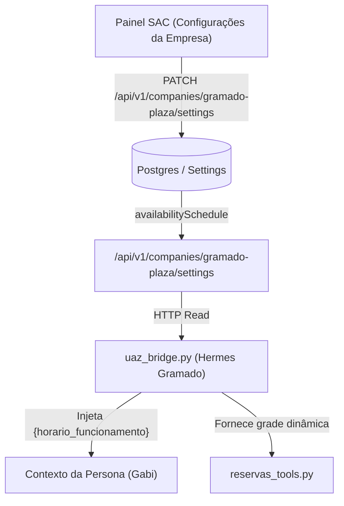

# Desenho de Arquitetura — Horário Editável do Gramado Plazza (Gabi)

> **⚠️ ATENÇÃO - TRAVA INEGOCIÁVEL DA CASA:**
> Este documento contém APENAS a especificação de desenho técnico e arquitetura.
> Nenhuma alteração de código ou de produção no Gramado Plazza pode ser realizada sem autorização explícita e prévia do Gastão, acompanhada de testes ao vivo por ele.

---

## 1. Diagnóstico do Estado Atual
A IA do Gramado Plazza (persona "Gabi") opera com horário de funcionamento das **18h00 às 22h30**, distribuído de forma descentralizada em 3 pontos no servidor Hermes:
1. **`SOUL.md`:** Instruções da persona em linguagem natural ("funcionamos das 18h às 22h30").
2. **`uaz_bridge.py`:** Lógica de montagem do contexto que injeta no prompt se o restaurante está aberto ou fechado no momento do atendimento.
3. **`reservas_tools.py`:** Fallback codificado rigidamente `18:00–22:30` para validação de horários de reserva quando a API do motor não devolve grade legível.

Comportamento atual: a Gabi atende mensagens a qualquer hora do dia ou da noite, porém ajusta a postura de conversação conforme o status de abertura.

---

## 2. Proposta de Arquitetura (Fonte Única de Verdade)
Para viabilizar a edição do horário do Gramado pelo Painel SAC sem dessincronização entre as 3 fontes:

### Detalhamento da Solução:
1. **SAC (Painel Admin):** Exibe a grade de horários editável (`availabilitySchedule`) para a empresa Gramado Plazza.
2. **`uaz_bridge.py` (Hermes):** Lê periodicamente ou a cada requisição a chave estruturada de horários enviada pelo SAC.
3. **Substituição Dinâmica no Prompt (`SOUL.md`):** Substitui a string fixa `18h às 22h30` pela variável `{horario_funcionamento}` injetada dinamicamente pelo `uaz_bridge.py` durante o assembly do contexto.
4. **`reservas_tools.py`:** Substitui os valores hardcoded pela leitura da mesma chave de configuração em memória.

---

## 3. Plano de Homologação e Testes (Pós-Autorização)
1. Criar ambiente de staging isolado no Hermes com número de testes interno.
2. Alterar o horário no painel SAC (ex: 19h00 às 23h00) e verificar se a Gabi reflete o novo horário nas respostas e na validação de reservas.
3. Submeter para validação e testes ao vivo com o Gastão antes de mover para a branch principal ou produção.
